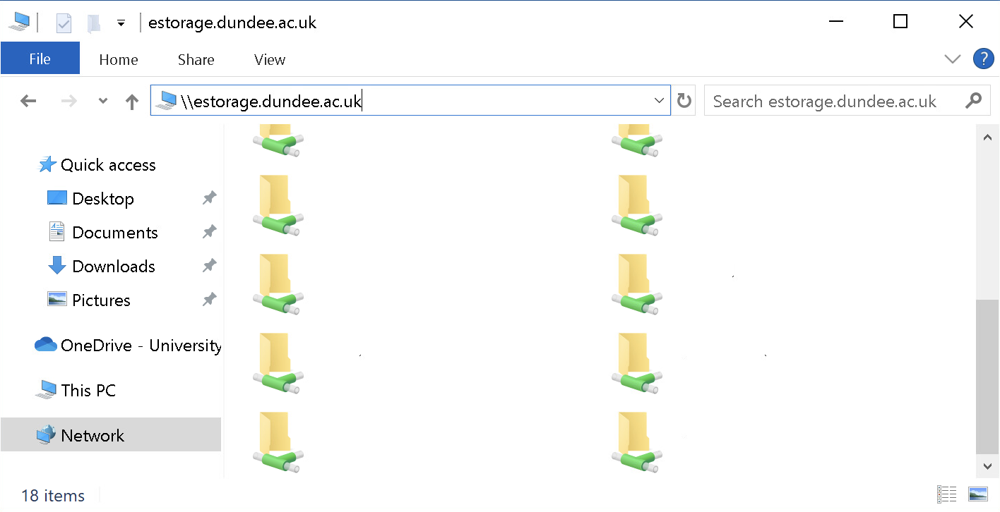
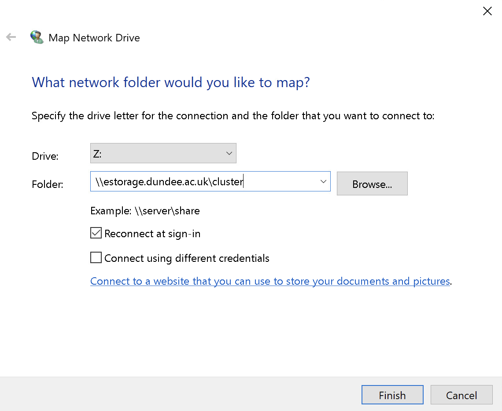
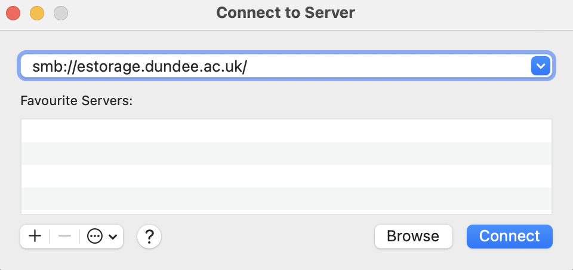

# Data Transfer

The recommended method for transferring data to the cluster storage is via Windows Shares/Samba. For performance reasons, scp or sftp to the login nodes is not supported.

## Windows

The share can be accessed by opening an Explorer instance and entering the following into the address bar:

```console
\\estorage.dundee.ac.uk
```



For convenience, this share can also be set up [as a network drive](https://support.microsoft.com/en-us/windows/map-a-network-drive-in-windows-29ce55d1-34e3-a7e2-4801-131475f9557d#ID0EBD=Windows_10).



## Mac

You can reach the share by opening a Finder instance, selecting "Go -> Connect to Server" from the menu bar and entering:

```console
smb://estorage.dundee.ac.uk
```



This will also create a directory under /Volumes with access to your share.
